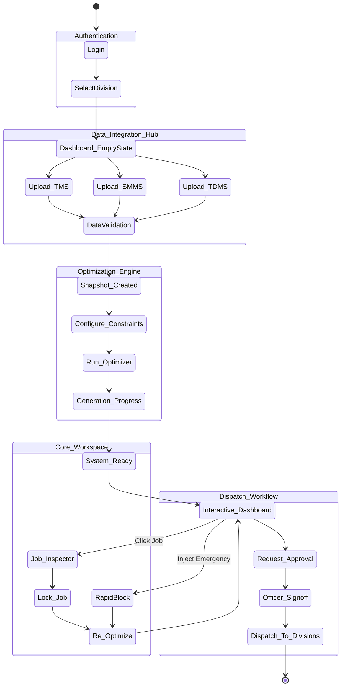
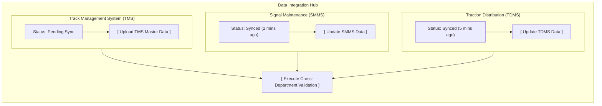
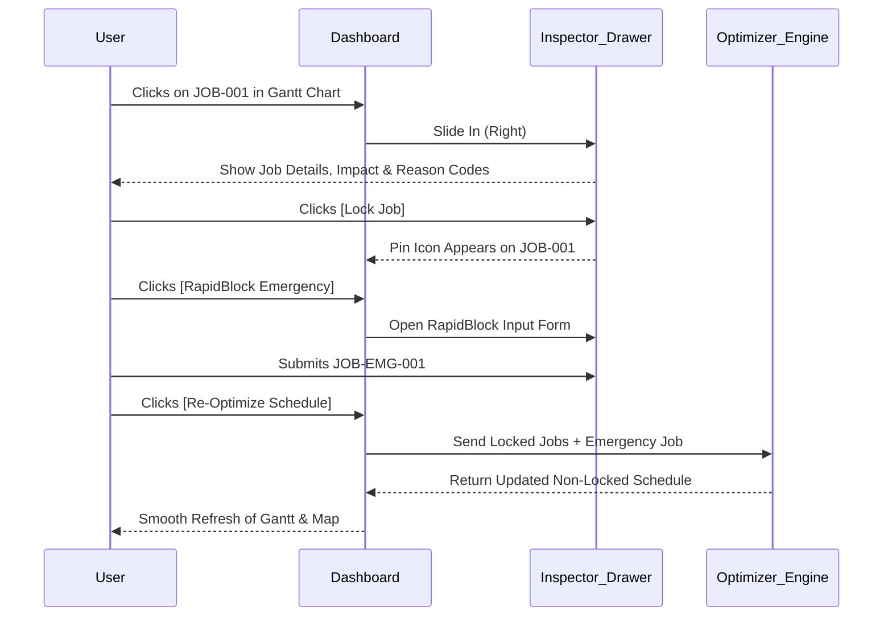
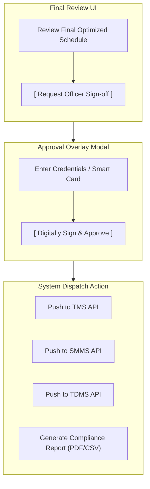

# Enterprise UI/UX Architecture: RailNiyojan

This document outlines the professional, enterprise-grade user interface and user experience flow for RailNiyojan. We are moving away from "hackathon demo" concepts to a robust, production-ready system architecture. The language, flows, and states reflect a system that a Railway Division would actually deploy.

---

## 1. Complete User Journey (State Machine)

This represents the end-to-end flow of the application, from secure access to final dispatch. This is the master map of the entire application.



---

## 2. Data Integration UI Flow (The Intake)

Instead of a basic "Start" button or "Upload Demo Data", the UI should look like an **Integration Hub** where different departments synchronize their master data.



---

## 3. UI Layout Wireframes (Visual Blueprints)

These diagrams represent the actual **visual layout on the screen**, translating the older ASCII mockups into the new Enterprise-grade interface.

### Frame 1: The Integration Hub (Formerly "Clean Launchpad")

This is what the user sees when they first log in, replacing the old "Load Demo Data" screen.

```text
+-------------------------------------------------------------+
|                                                             |
|                   RailNiyojan Enterprise                    |
|                                                             |
|       [ 🛤️ TMS Data ]  [ 🚦 SMMS Data ]  [ ⚡ TDMS Data ]       |
|                                                             |
|               +-----------------------------+               |
|               | [Execute Cross-Dept Sync]   |               |
|               +-----------------------------+               |
|                                                             |
+-------------------------------------------------------------+
```

### Frame 2: The Unified Canvas (Main Planning Desk)

This shows exactly where elements sit on the screen. The Map and Gantt share the main left area, while the Inspector lives on the right.

```text
+-------------------------------------------------------------+
| 🟢 OPTIMAL | SNAP-001 | 👤 Div. Manager                     |
|                                     [RapidBlock] [Approve]  |
+-------------------------------------------------------------+
|                                               |             |
|   (SEC-A)-------(SEC-B)-------(SEC-C)         |  INSPECTOR  |
|      📍            📍                         |  DRAWER     |
|                                               |             |
|   [KPI: ⚡ 36% Downtime Saved ]               |  JOB-001    |
| - - - - - - - - - - - - - - - - - - - - - - - |  [LOCKED]   |
|                                               |             |
|   Mon | (=== JOB-001 ===)                     |  Reason:    |
|   Tue |          (=== JOB-002 ===)            |  Priority   |
|   Wed | (== TRAIN PATH ==)                    |             |
|                                               |  [ 🔒 Lock ]|
+-------------------------------------------------------------+
```

---

## 4. Interaction Flow: Modification & RapidBlock

Enterprise users need to modify AI plans. This sequence diagram shows how the UI state changes when a user clicks on a job to lock it, or needs to inject an emergency RapidBlock.



---

## 5. The Dispatch & Approval Flow

Enterprise software doesn't just "export a CSV". It routes for approval and dispatches to operational units.


