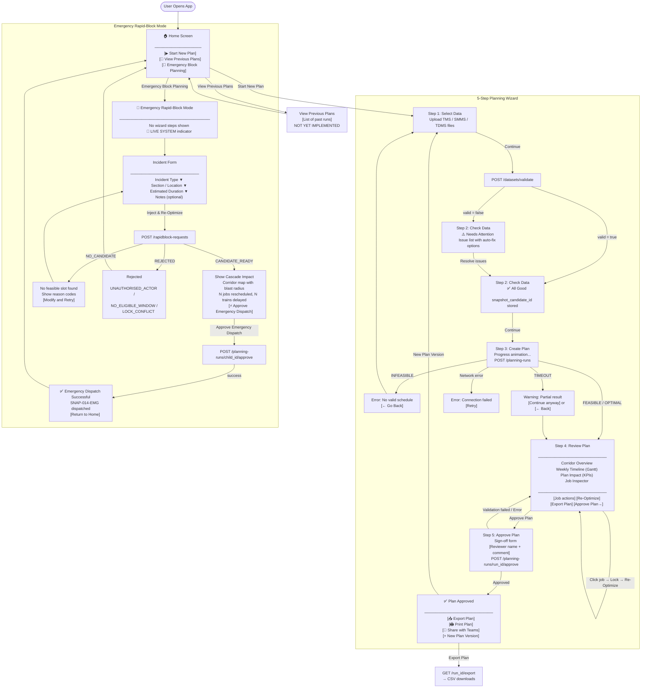

# Application Flow Diagram

The complete application state machine from entry to exit.

```mermaid
flowchart TD
    ENTRY([User Opens App]) --> HOME

    HOME["🏠 Home Screen
    ─────────────────
    [▶ Start New Plan]
    [📁 View Previous Plans]
    [🚨 Emergency Block Planning]"]

    HOME -->|Start New Plan| STEP1
    HOME -->|View Previous Plans| PLANS
    HOME -->|Emergency Block Planning| EMERGENCY

    subgraph WIZARD ["5-Step Planning Wizard"]
        STEP1["Step 1: Select Data
        Upload TMS / SMMS / TDMS files"]

        STEP1 -->|Continue| VALIDATE["POST /datasets/validate"]

        VALIDATE -->|valid = true| STEP2_OK
        VALIDATE -->|valid = false| STEP2_ERR

        STEP2_OK["Step 2: Check Data
        ✅ All Good
        snapshot_candidate_id stored"]

        STEP2_ERR["Step 2: Check Data
        ⚠️ Needs Attention
        Issue list with auto-fix options"]

        STEP2_ERR -->|Resolve issues| STEP2_OK
        STEP2_OK -->|Continue| STEP3

        STEP3["Step 3: Create Plan
        Progress animation...
        POST /planning-runs"]

        STEP3 -->|FEASIBLE / OPTIMAL| STEP4
        STEP3 -->|INFEASIBLE| ERR_INFEASIBLE["Error: No valid schedule
        [← Go Back]"]
        STEP3 -->|TIMEOUT| ERR_TIMEOUT["Warning: Partial result
        [Continue anyway] or [← Back]"]
        STEP3 -->|Network error| ERR_NETWORK["Error: Connection failed
        [Retry]"]

        STEP4["Step 4: Review Plan
        ─────────────────────────
        Corridor Overview
        Weekly Timeline (Gantt)
        Plan Impact (KPIs)
        Job Inspector
        ─────────────────────────
        [Job actions] [Re-Optimize]
        [Export Plan] [Approve Plan→]"]

        STEP4 -->|Click job → Lock → Re-Optimize| STEP4
        STEP4 -->|Approve Plan| STEP5

        STEP5["Step 5: Approve Plan
        Sign-off form
        [Reviewer name + comment]
        POST /planning-runs/run_id/approve"]

        STEP5 -->|Approved| APPROVED
        STEP5 -->|Validation failed / Error| STEP4
    end

    APPROVED["✅ Plan Approved
    ─────────────────────────
    [📥 Export Plan]
    [🖨️ Print Plan]
    [👥 Share with Teams]
    [+ New Plan Version]"]

    APPROVED -->|Export Plan| EXPORT["GET /run_id/export
    → CSV downloads"]
    APPROVED -->|New Plan Version| STEP1

    PLANS["View Previous Plans
    [List of past runs]
    NOT YET IMPLEMENTED"]
    PLANS --> HOME

    subgraph EMERGENCY_FLOW ["Emergency Rapid-Block Mode"]
        EMERGENCY["🚨 Emergency Rapid-Block Mode
        ─────────────────────────────────
        No wizard steps shown
        🔴 LIVE SYSTEM indicator"]

        EMERGENCY --> EMRG_FORM["Incident Form
        ─────────────────────────
        Incident Type ▼
        Section / Location ▼
        Estimated Duration ▼
        Notes (optional)"]

        EMRG_FORM -->|Inject & Re-Optimize| EMRG_API["POST /rapidblock-requests"]

        EMRG_API -->|CANDIDATE_READY| EMRG_IMPACT["Show Cascade Impact
        Corridor map with blast radius
        N jobs rescheduled, N trains delayed
        [⚡ Approve Emergency Dispatch]"]

        EMRG_API -->|NO_CANDIDATE| EMRG_FAIL["No feasible slot found
        Show reason codes
        [Modify and Retry]"]

        EMRG_API -->|REJECTED| EMRG_REJECT["Rejected
        UNAUTHORISED_ACTOR /
        NO_ELIGIBLE_WINDOW /
        LOCK_CONFLICT"]

        EMRG_IMPACT -->|Approve Emergency Dispatch| EMRG_APPROVE["POST /planning-runs/child_id/approve"]
        EMRG_APPROVE -->|success| EMRG_SUCCESS["✅ Emergency Dispatch Successful
        SNAP-014-EMG dispatched
        [Return to Home]"]
        EMRG_SUCCESS --> HOME
    end

    ERR_INFEASIBLE --> STEP1
    ERR_TIMEOUT --> STEP4
    EMRG_FAIL --> EMRG_FORM
    EMRG_REJECT --> HOME
```
