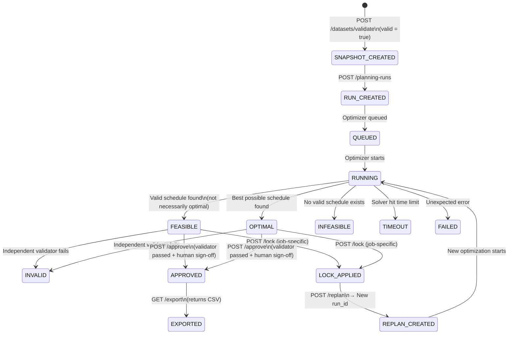
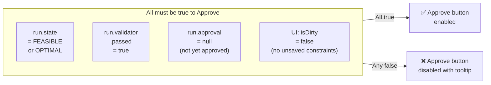
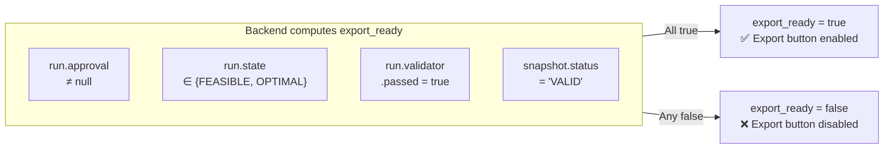
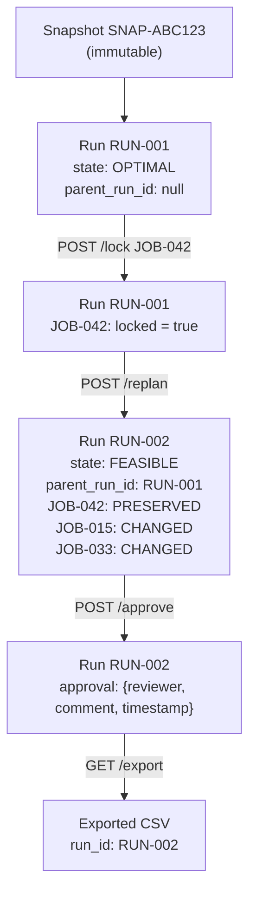
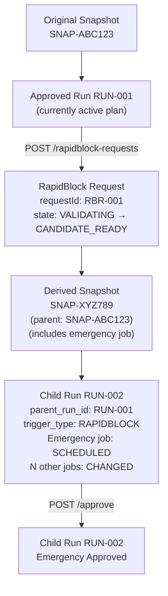

# Plan Lifecycle Diagram

The complete lifecycle of a planning run from creation to export, including all state transitions, approval gates, and frontend-visible events.

## Plan State Transitions

## Approval Gate Rules

## Export Gate Rules

## Replan Lineage

## RapidBlock Lineage

