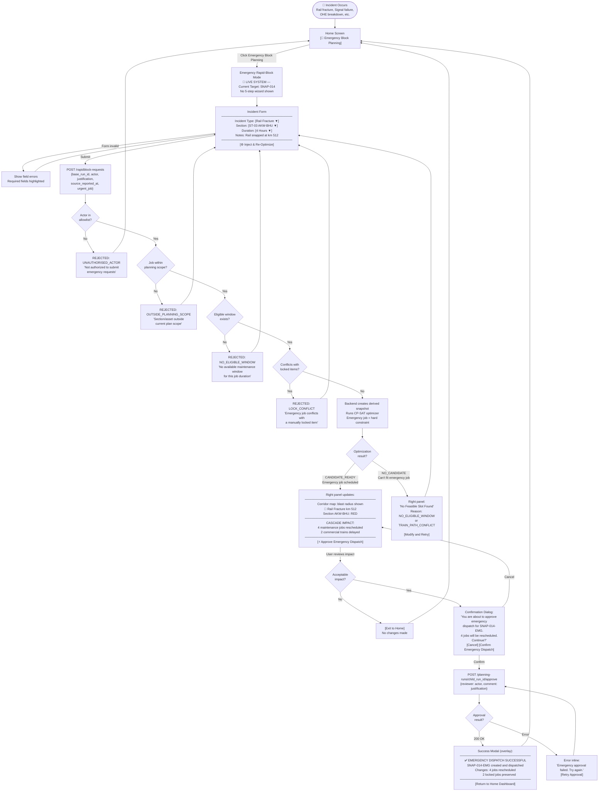
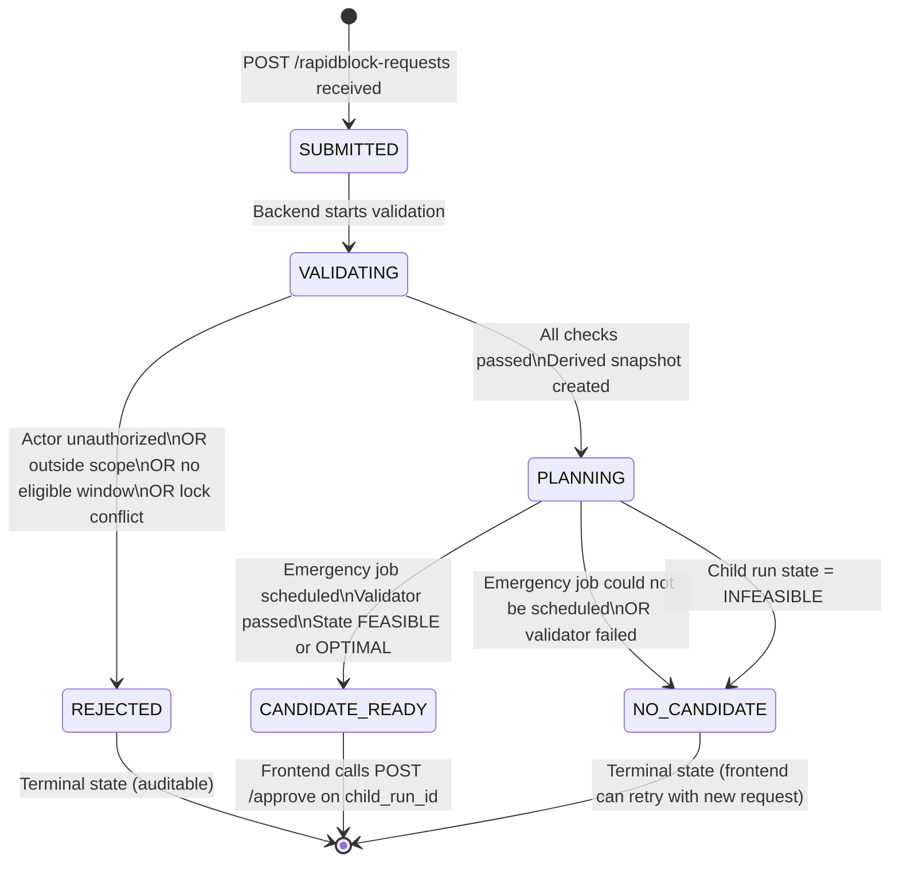
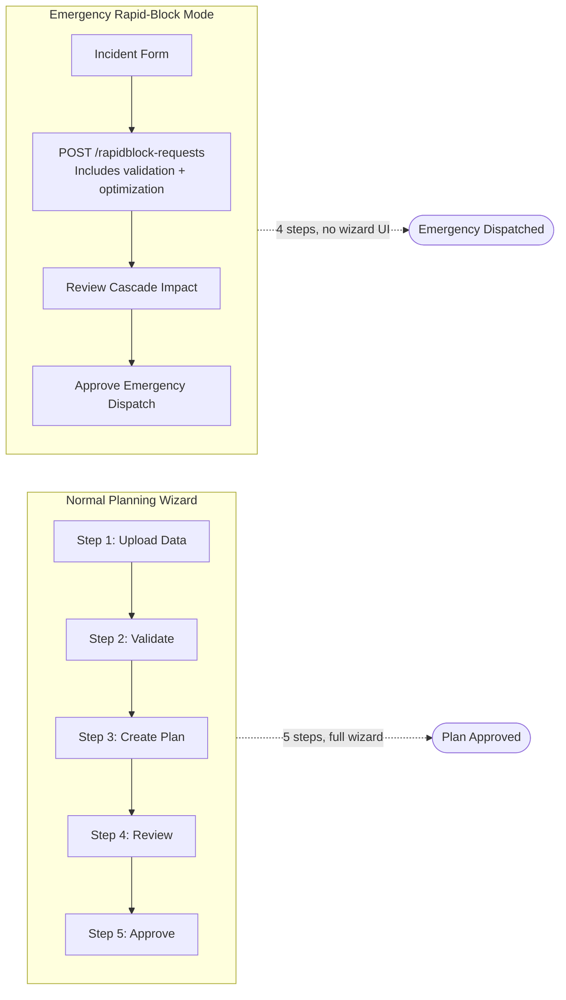

# Rapid Blocking Flow Diagram

The complete Emergency Rapid-Block workflow from incident report to dispatch.

## Full Rapid-Block Flow

## Backend State Machine for RapidBlock

## Emergency vs Normal Plan — Key Differences

