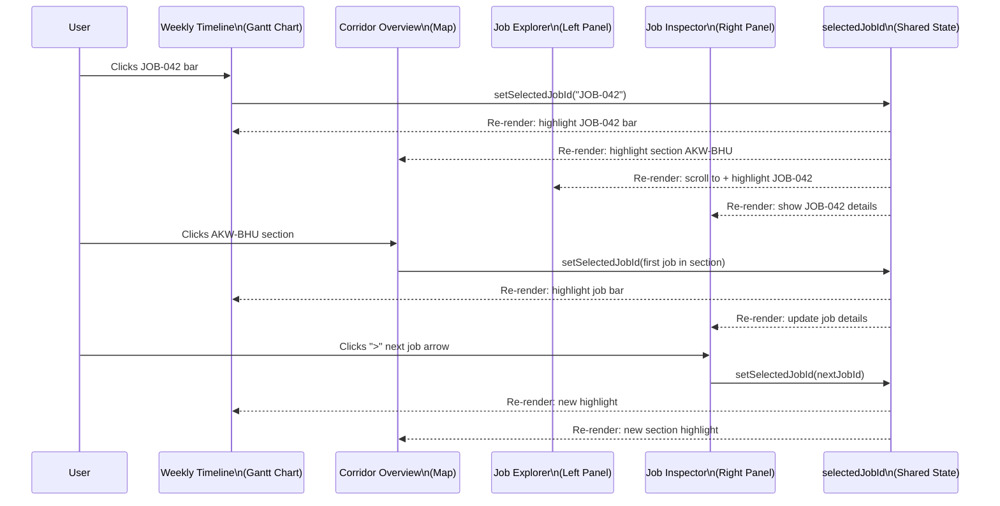
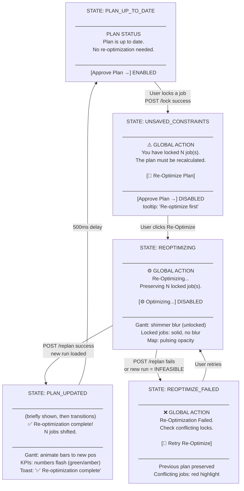
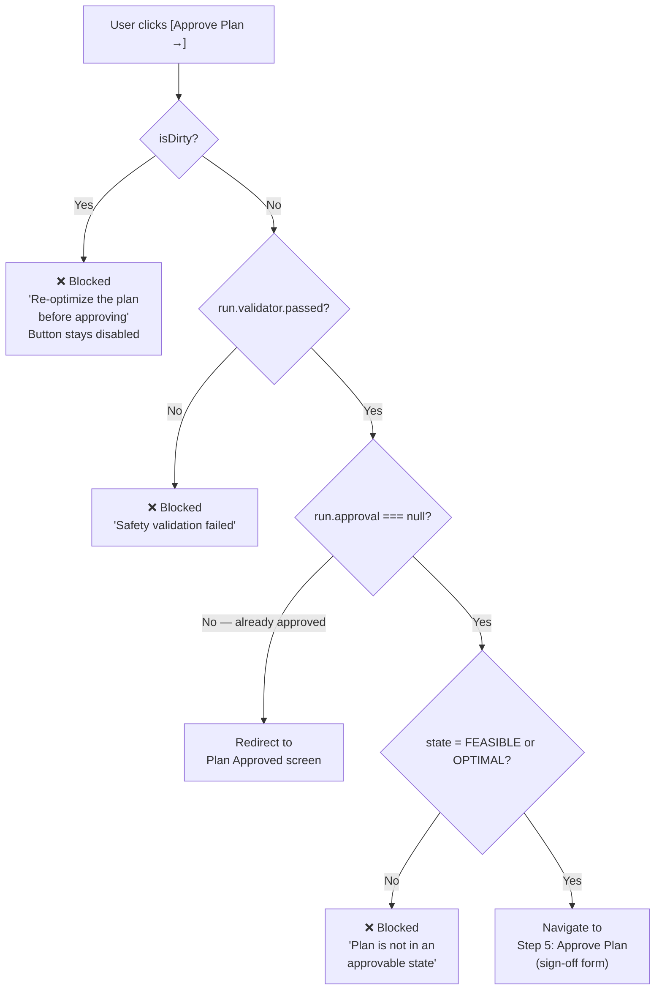

# Review Plan State Machine

The complete interaction diagram for the Review Plan screen (Step 4).

## Job Selection Synchronization

When a user selects a job from any of the three components (Gantt, Map, Explorer), all components update:

## Lock and Re-Optimize Flow

```mermaid
stateDiagram-v2
    [*] --> PLAN_UP_TO_DATE : Plan loaded from GET /planning-runs

    PLAN_UP_TO_DATE --> INSPECTING : User selects a job
    INSPECTING --> PLAN_UP_TO_DATE : User deselects / closes inspector

    INSPECTING --> LOCKING : User clicks Lock in Schedule
    LOCKING --> LOCK_SUCCESS : POST /lock returns 200
    LOCKING --> LOCK_FAILED : POST /lock returns error

    LOCK_FAILED --> INSPECTING : Show error toast, stay on same job

    LOCK_SUCCESS --> UNSAVED_CONSTRAINTS : isDirty = true\nRe-Optimize panel activates\nApprove Plan button disables

    UNSAVED_CONSTRAINTS --> REOPTIMIZING : User clicks Re-Optimize Plan
    UNSAVED_CONSTRAINTS --> INSPECTING : User inspects another job (can lock more)

    REOPTIMIZING --> PLAN_UPDATED : POST /replan returns new run_id\nGET /planning-runs/new_id succeeds
    REOPTIMIZING --> REOPTIMIZE_FAILED : POST /replan returns INFEASIBLE\nor network error

    PLAN_UPDATED --> PLAN_UP_TO_DATE : isDirty = false\nNew schedule rendered\nApprove Plan button re-enables

    REOPTIMIZE_FAILED --> UNSAVED_CONSTRAINTS : Preserve previous plan\nShow error panel\nOffer Retry

    PLAN_UP_TO_DATE --> APPROVING : User clicks Approve Plan →
    APPROVING --> APPROVED : POST /approve returns 200
    APPROVING --> PLAN_UP_TO_DATE : POST /approve returns error\nShow inline error

    APPROVED --> [*] : Navigate to Plan Approved screen
```

## Global Re-Optimize Panel States

## Approve Plan Guard

