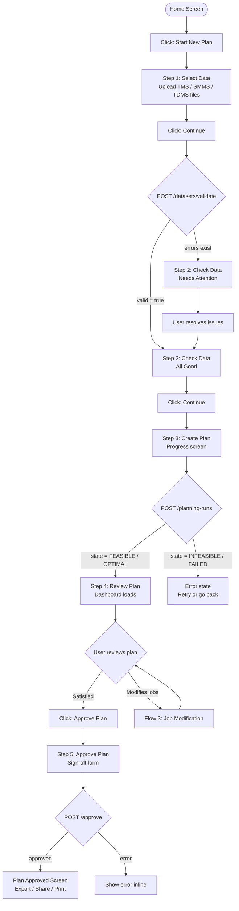
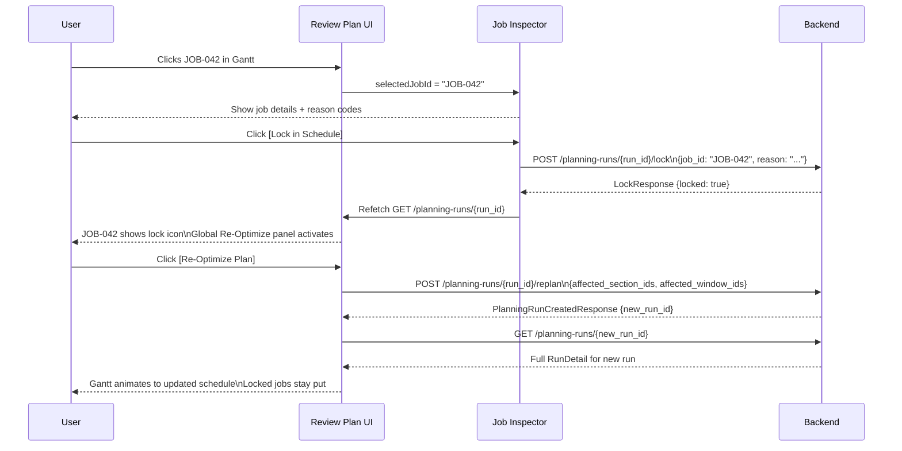
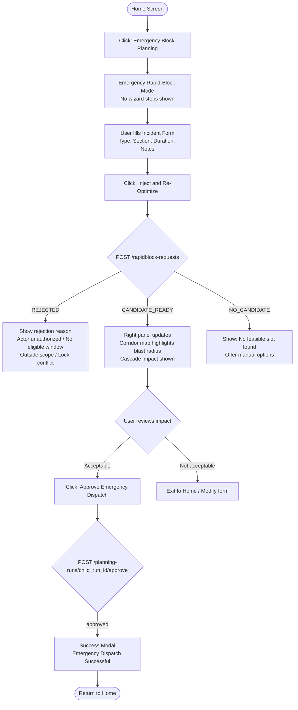

# 03 — User Flows

All major user journeys are documented here with step-by-step descriptions and Mermaid diagrams.

---

## Flow 1: New Plan (The Standard 5-Step Wizard)

### Step-by-step

1. User opens the Home screen and clicks **Start New Plan**.
2. User is taken to **Step 1: Select Data**. They upload TMS, SMMS, and TDMS data files (CSV or JSON), or skip a department to use no data for that department. They click **Continue**.
3. Frontend calls `POST /datasets/validate` with the combined dataset payload.
4. User sees **Step 2: Check Data**. If validation passed: "All Good". If validation has errors: "Needs Attention" with a list of issues. User resolves or acknowledges issues. They click **Continue** (only allowed if `validation.valid === true`).
5. User reaches **Step 3: Create Plan**. They see a progress animation. Frontend calls `POST /planning-runs` with the `snapshot_candidate_id` from the validation response.
6. When the run returns, the user is automatically advanced to **Step 4: Review Plan**. The full dashboard loads with the plan data.
7. User inspects jobs, optionally locks items, and optionally re-optimizes. See [Flow 3](#flow-3-job-modification-and-re-optimization) for that sub-flow.
8. When satisfied, user clicks **Approve Plan →** in Step 4. This opens the **Step 5: Approve Plan** modal/screen.
9. User enters their name and a comment. They click **Digitally Sign & Approve**.
10. Frontend calls `POST /planning-runs/{run_id}/approve`.
11. Plan transitions to approved state. User sees **Plan Approved** confirmation with export options.

### Mermaid Diagram

---

## Flow 2: View Previous Plans

1. User opens the Home screen and clicks **View Previous Plans**.
2. User sees a list of past plans (run_id, state, date, approval status).
3. User clicks a plan to open it.
4. The **Review Plan** screen loads in **Read-Only mode** (approved plan — no Approve button, shows Export/Print/Share instead).

> **NOT YET IMPLEMENTED**: A "list previous plans" endpoint does not exist in the backend. The current backend uses an in-memory store. See [16-open-questions.md](./16-open-questions.md).

---

## Flow 3: Job Modification and Re-Optimization

This is a sub-flow within Step 4 (Review Plan).

### Step-by-step

1. User clicks on a job in the **Gantt chart** or **Corridor Map**.
2. `selectedJobId` updates in React state.
3. **Job Inspector** slides in and shows job details, reason codes, and AI explanation.
4. User takes one of four job-specific actions:
   - **Lock in Schedule**: Calls `POST /planning-runs/{run_id}/lock`. Run updates with `schedule_item.locked = true`. Plan state becomes "dirty" (has unsaved constraints). Global Re-Optimize panel becomes active.
   - **Change Window** (`NOT YET IMPLEMENTED`): Would allow manually selecting a different window.
   - **Find Alternative** (`NOT YET IMPLEMENTED`): Would ask AI for next-best slot for this specific job.
   - **Exclude from Plan** (`NOT YET IMPLEMENTED`): Would remove the job from the current plan.
5. If user locked a job, the **Global Re-Optimize panel** shows "You have locked X jobs. Re-optimization needed."
6. User clicks **Re-Optimize Plan**.
7. Frontend calls `POST /planning-runs/{run_id}/replan` with `affected_section_ids` and `affected_window_ids`.
8. Backend returns a **new run** with a new `run_id`. The frontend must update its active run reference to the new `run_id`.
9. The Gantt chart and Corridor Map animate to the new schedule. Locked jobs remain fixed. Other jobs may have moved (shown with `changes[job_id] === "CHANGED"`).
10. User continues reviewing or approves.

### Mermaid Diagram

---

## Flow 4: Plan Approval and Export

1. User is on the Review Plan screen (Step 4). Plan state is FEASIBLE or OPTIMAL. Validator has passed.
2. User clicks **Approve Plan →** button.
3. **Step 5: Approve Plan** screen appears (modal or full step).
4. User fills in their name (reviewer) and an approval comment.
5. User clicks **Digitally Sign & Approve**.
6. Frontend calls `POST /planning-runs/{run_id}/approve`.
7. On success: screen transitions to **Plan Approved** state.
8. Approve button is hidden. Export, Print, Share options become available.
9. User clicks **Export Plan** → frontend calls `GET /planning-runs/{run_id}/export` → CSV downloads automatically.

---

## Flow 5: Emergency Rapid-Block Mode

This flow is **completely separate** from the 5-step wizard. It is accessible directly from the Home screen as a third option.

### Step-by-step

1. User clicks **Emergency Block Planning** on the Home screen.
2. System enters **Emergency Rapid-Block Mode**. The 5-step progress bar is NOT shown.
3. The header shows `🔴 LIVE SYSTEM | Target: SNAP-014` to indicate this modifies the active plan.
4. **Left panel**: User fills in incident form:
   - Incident Type (e.g., Rail Fracture, Signal Failure, OHE Breakdown)
   - Section / Location (dropdown from available sections)
   - Estimated Duration (in hours)
   - Notes (free text)
5. **Right panel**: A corridor map shows the affected area. Cascade impact is estimated (requires a prior `base_run_id` to be selected or pre-loaded).
6. User clicks **Inject & Re-Optimize**.
7. Frontend calls `POST /rapidblock-requests` with the full urgent job payload.
8. Backend responds with state `CANDIDATE_READY` or `NO_CANDIDATE` or `REJECTED`.
9. If `CANDIDATE_READY`: Right panel updates showing changed jobs, preserved locked jobs, cascade impact.
10. User reviews the impact. If acceptable, clicks **Approve Emergency Dispatch**.
11. Frontend calls `POST /planning-runs/{child_run_id}/approve`.
12. Success: Modal shows "Emergency Dispatch Successful". User is returned to Home.

### Mermaid Diagram

