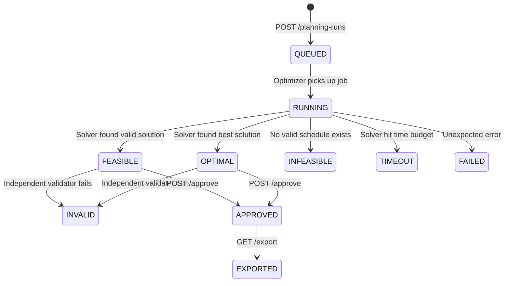
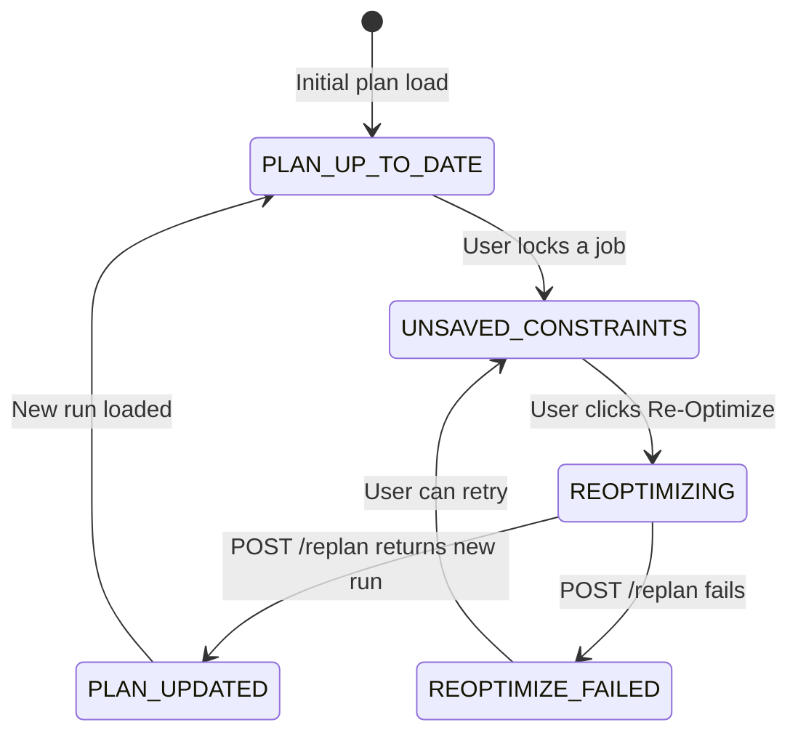
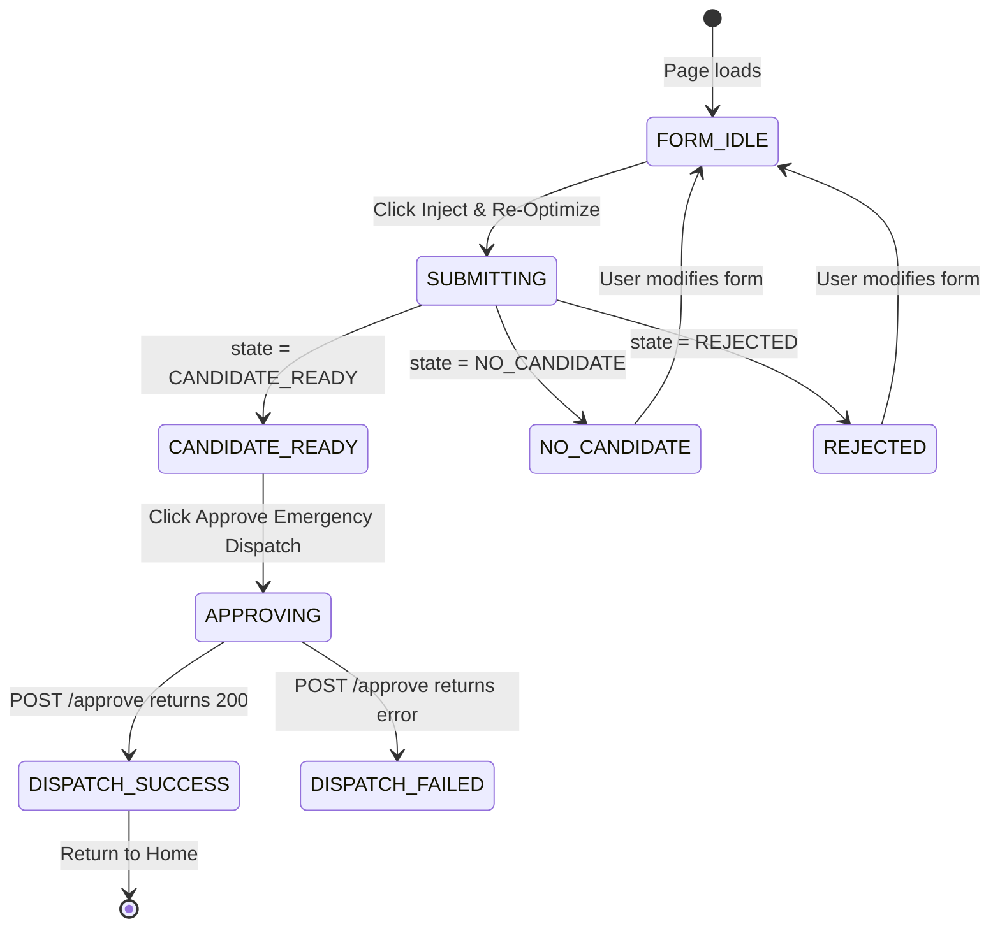

# 06 — UI State Model

This document defines all important frontend state machines and separates server state from UI state from local temporary state.

---

## State Categories

### SERVER STATE
Values that come from the backend API. The frontend must never invent these. Use TanStack Query or similar for server state.

### UI STATE
Transient display decisions. Stored in React `useState`. Does not need to persist across refreshes.

### LOCAL WORKFLOW STATE
Temporary state needed for the current wizard session. Lost on navigation away.

---

## Plan State Machine

**Source**: `run.state` from `GET /planning-runs/{run_id}`.
**Type**: SERVER STATE



**Frontend rendering rules by state**:

| State | Review Plan UI Behaviour |
|-------|--------------------------|
| `QUEUED` | Show "Queued..." (polling if backend is async) |
| `RUNNING` | Show "Optimizing..." (polling if backend is async) |
| `FEASIBLE` | Show full dashboard. "Feasible" badge. Approve button enabled if validator passed. |
| `OPTIMAL` | Show full dashboard. "Optimal" badge (green). Approve button enabled if validator passed. |
| `INFEASIBLE` | Show error state. No schedule to display. Show unscheduled jobs with reason codes. |
| `TIMEOUT` | Show warning. Partial schedule may exist. Allow review but warn about completeness. |
| `INVALID` | Show validation failure. Block approval. Show validator issues. |
| `FAILED` | Show critical error. Offer retry. |

---

## Approval & Export Gate State

**Type**: Derived from SERVER STATE

The backend computes `export_ready` but the frontend also needs to know when Approve is available.

```
approveEnabled =
  run.state === "FEASIBLE" || run.state === "OPTIMAL"
  AND run.validator.passed === true
  AND run.approval === null

exportEnabled =
  run.export_ready === true
  (backend computes: approval !== null AND state in {FEASIBLE, OPTIMAL} AND validator_passed AND snapshot.status === "VALID")

approvedMode =
  run.approval !== null
```

In `approvedMode`:
- Hide "Approve Plan" button entirely
- Show "Export Plan", "Print Plan", "Share with Teams", "Create New Plan Version"
- All job modification actions (Lock, Find Alternative, Exclude) are disabled
- Re-Optimize button is hidden

---

## Dirty Plan State (Has Unsaved Constraints)

**Type**: LOCAL WORKFLOW STATE

This is a frontend-only concept. The backend has no concept of a "dirty" plan.

**When it is set to `true`**:
- User clicks "Lock in Schedule" on any job successfully (after `POST /lock` returns 200)

**When it resets to `false`**:
- User successfully calls "Re-Optimize Plan" (`POST /replan` returns new run)
- User navigates away from the Review Plan screen

**UI effect when `isDirty === true`**:
- Global Re-Optimize panel becomes prominent and animated
- Approve Plan button is disabled with tooltip: "Plan has unsaved constraints. Please re-optimize first."
- A banner shows: "⚠️ You have locked N job(s). The plan must be recalculated before approval."

```typescript
// LOCAL WORKFLOW STATE
const [isDirty, setIsDirty] = useState(false);
const [lockedJobsCount, setLockedJobsCount] = useState(0);

// Set dirty after successful lock
async function handleLock(jobId: string) {
  await lockScheduleItem(run.run_id, jobId);
  setIsDirty(true);
  setLockedJobsCount(prev => prev + 1);
}

// Reset dirty after successful replan
async function handleReoptimize() {
  const newRun = await replanRun(run.run_id, affectedSections, affectedWindows);
  setActiveRun(newRun);
  setIsDirty(false);
  setLockedJobsCount(0);
}
```

---

## Optimization State (Re-Optimize In Progress)

**Type**: LOCAL WORKFLOW STATE + transient UI STATE



**UI per optimization state**:

| State | Global Re-Optimize Panel | Approve Button | Gantt/Map |
|-------|--------------------------|----------------|-----------|
| `PLAN_UP_TO_DATE` | Hidden | Enabled (if valid) | Normal |
| `UNSAVED_CONSTRAINTS` | Prominent with warning | Disabled | Lock icons on locked jobs |
| `REOPTIMIZING` | Shows "Optimizing..." spinner | Disabled | Shimmer blur over unlocked jobs. Locked jobs remain solid. |
| `PLAN_UPDATED` | Brief "✅ Re-optimization complete" toast | Enabled | Jobs animate to new positions |
| `REOPTIMIZE_FAILED` | Shows error + Retry button | Disabled | Previous plan preserved (no changes) |

---

## Job Selection State

**Type**: UI STATE

```typescript
const [selectedJobId, setSelectedJobId] = useState<string | null>(null);
```

**Selection triggers**:
- Click a bar in the Gantt Chart → `setSelectedJobId(item.job_id)`
- Click a node in the Corridor Map → `setSelectedJobId(job.job_id)`
- Click a row in the Job Explorer (left panel) → `setSelectedJobId(job.job_id)`

**Effect of selection**:
- Job Inspector panel opens (or updates if already open)
- The selected job is highlighted in the Gantt Chart (highlighted bar)
- The selected job's section is highlighted in the Corridor Map
- The left panel (Job Explorer) scrolls to and highlights the job

**Cross-component synchronization**: All three components (Gantt, Map, Explorer) must react to the same `selectedJobId` source. Pass it as a prop or share via React Context.

---

## Validation State

**Type**: LOCAL WORKFLOW STATE

Tracks the result of the dataset validation step.

```typescript
type ValidationState =
  | { status: 'idle' }
  | { status: 'loading' }
  | { status: 'valid'; result: ValidationResponse }
  | { status: 'invalid'; result: ValidationResponse }
  | { status: 'error'; message: string };
```

**Continue button rules**:
- `idle`: Disabled
- `loading`: Disabled, shows spinner
- `valid`: Enabled
- `invalid`: Disabled, show error message
- `error`: Disabled, show retry option

---

## Emergency Block State (RapidBlock)

**Type**: LOCAL WORKFLOW STATE + SERVER STATE



**UI per rapid block state**:

| State | Left Panel | Right Panel | Buttons |
|-------|-----------|-------------|---------|
| `FORM_IDLE` | Form empty and editable | Static map | `[Inject & Re-Optimize]` enabled |
| `SUBMITTING` | Form disabled | "Calculating impact..." spinner | All disabled |
| `CANDIDATE_READY` | Form locked | Map + cascade impact shown | `[Approve Emergency Dispatch]` enabled |
| `NO_CANDIDATE` | Form editable | "No feasible slot found" message | `[Modify and Retry]` |
| `REJECTED` | Form editable | Rejection reason shown | `[Modify and Retry]` |
| `APPROVING` | — | — | All disabled, "Approving..." |
| `DISPATCH_SUCCESS` | — | — | Success modal over screen |
| `DISPATCH_FAILED` | — | Error message | `[Retry Approval]` |
